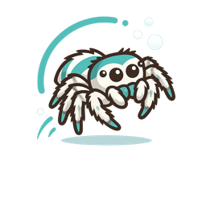

<div align="center">
  

  <h1>
    
    portia
  </h1>
  <p><strong>Start catching the bugs in your data.</strong></p>

  <p>
    
    
    
    
    
    
  </p>

  <sub>Named after <a href="https://en.wikipedia.org/wiki/Portia_(spider)"><em>Portia</em></a>, the jumping
  spider that stalks other spiders — it studies a web, plans a detour out of sight of its prey, and takes it.</sub>
</div>

---

An agent-assisted data-harmonization copilot — from *N ugly sources* to *one table you trust*.
It dives into your data and comes back with questions and insights, surfacing mismatched units,
missing values, and near-duplicate entities as decisions to make rather than silent guesses —
and records every choice as a durable, reproducible artifact.

Every number it tells you comes from deterministic code, never from the model reading your data.
The engine runs on DuckDB, so it works on tables too big to open: your files are read where they
lie — portia copies nothing — and a join that would explode to 80 million rows is *counted* rather
than built. CSV and Parquet.

**What you keep is a pipeline.** Every decision is recorded as a spec (git-diffable YAML: the keys,
the prediction, and *why*), and every spec compiles to one `.sql` file that builds one table —
dbt-shaped, so it drops into a dbt project unchanged. The specs are the reasoning; the SQL is what
runs.

## The app

Three panes — your files, the workflow, and the copilot — in one window:

```bash
uv sync --extra ui --extra agent
python -m portia.ui
```

Open a project directory (it gets created if it isn't there), write a few lines about what the
project *is*, drop your data in — CSV or Parquet — and go. Every question the copilot asks and every write it wants to
make stops on screen, with the evidence still next to it.

Pressing **Run** executes the spec in memory; **Write outputs** saves the produced table to `out/`
and **Save report** saves the run as markdown to `runs/`. Nothing is written until you ask.

## Your data stays where you put it

portia plugs into a repo that **already holds its data**, and you choose what is in scope. It
indexes files inside the project and nothing outside it, it never modifies them, and it keeps no
second copy of its own. Bringing an outside file in is a separate, deliberate step that tells you
what it is about to copy and where:

```bash
python -m portia.cli.import_data ~/Downloads/vendor.csv --to data
```

## The CLIs

The same engine, if you'd rather stay in a terminal:

```bash
python -m portia.cli.index data          # profile sources into the catalog
python -m portia.cli.chat  ask "..."     # a copilot turn
python -m portia.cli.run   specs/x.yaml  # execute one spec (--write out --report runs)
python -m portia.cli.build               # compile every spec to models/*.sql
python -m portia.cli.build --check       # CI: fail if a .sql no longer matches its spec
python -m portia.cli.knowledge           # build the knowledge graph and print what's in it
```

## The knowledge graph

*Being built — the write path only ([design](docs/KNOWLEDGE_GRAPH.md)).* portia knows which column
in a spec came from which column in a file, and until now nothing could ask it. The graph holds
that lineage, plus every source, model, column and group, and it is built from the catalog and the
specs alone — no data is read.

Printing it needs nothing. Storing and querying it needs Neo4j, which is optional on purpose:

```bash
docker compose up -d neo4j
uv sync --extra graph
NEO4J_PASSWORD=portia-dev python -m portia.cli.knowledge --write
```

## Docs

- [Direction](docs/PLAN.md) — where this is going, and where it actually is
- [Evaluation](docs/EVALUATION.md) — how the copilot is scored, and its honest current score
- [Tech stack](docs/TECH_STACK.md)
- [Product vision](docs/VISION.md)
- [Design](DESIGN.md)
- [The scale tier](docs/DUCKDB_MIGRATION.md) — what the DuckDB engine cost, and what it found
- [The knowledge graph](docs/KNOWLEDGE_GRAPH.md) — relationships between sources, and column lineage
- [Backlog](docs/BACKLOG.md)
- [Brief](docs/brief.md)
